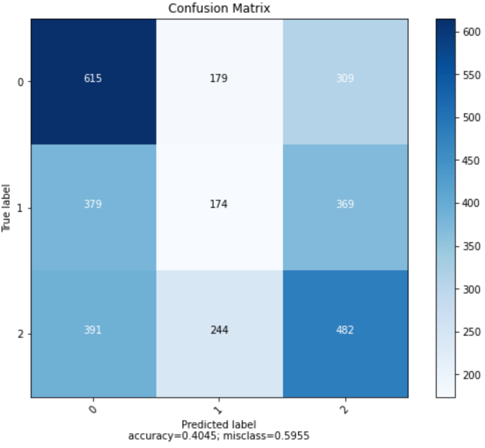
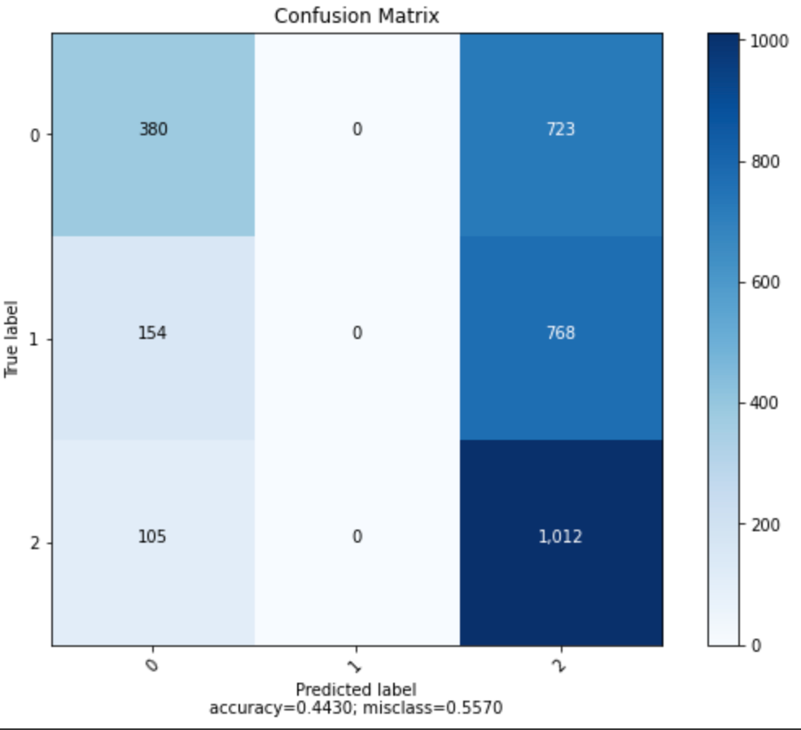

# Predicting Video Game Performance Levels 🎮

Intro

## Doc Overview 📄

This project was the 2nd capstone for my Thinkful coursework. The "Capstone_2.ipynb" file is the Jupyter Notebook containing my code for the project.

The other file, "Predicting Video Game Performance", is the slide deck that was used for the presentation.

## Background ✨

Video games are a large industry in the United States. In 2020, a year where several people were at home due to the pandemic,
the $56.9 billion industry was 27% higher than 2019. With such a large industry, being able to predict which games
will perform well or not-so-well can be useful for a variety of reasons. A video game franchise can use this knowledge to
determine which games to promote so they can maximize sales or the information can be used to help determine what kind of
games to invest in before they're actually released. In this project, I explore some methods for predicting how well
a video game will perform in the global market.

Part I

This section goes over the dataset, exploration, and model preparation portions of the project.

## The Dataset 🗄️

The dataset can be found on [Kaggle](https://www.kaggle.com/gregorut/videogamesales). It contains 16,598 records
of video game data scraped from [VGChartz](https://www.vgchartz.com/). 

The following columns were in the original file:

* Rank
* Name
* Platform
* Year
* Genre
* Publisher
* NA_Sales
* EU_Sales
* JP_Sales
* Other_Sales
* Global_Sales

## Feature Engineering 👨🏽‍🔬

In an effort to help address class imbalances in the platform and publisher variables, the platforms were merged based on
their console type. For example: Game Boy Advance, Nintendo 64, 3DS, and others were merged into a "Nintendo Console" class.
This merging of classes can be seen in the next 2 images.

  
Since this was a classification problem, a target variable had to be created. The Performance Level of a video game
indicates whether it'll perform as well as the top, middle, or bottom third of all video games.
  
The final features and target variable used in our training data were:
* Platform Category (Nintendo, Playstation, PC/XBOX/Other)
* Publisher Volume (At least 10 games, Between 1 and 10 games, and 1 game)
* Genre (Adventure, Arcade, and 10 others)
* Performance Category (Top, Middle, Bottom Third)

Note: This does seem like a good bit of features to have for training purposes after one-hot encoding. However,
after Principal Component Analysis and Multiple Correspondence Analysis yielding no benefits, the features were left as is.

Part II
 
  
  This section goes over the implementation and evaluation of models.
  
## Implemented Models and Range of Accuracies
  
  The following table shows the supervised learning algorithms used and their respective accuracies on the test set
  with cross-validation.
  
  | Model Type | Range of Accuracies with CV (%) |
  | ---------- | ------------------------------- |
  | Logistic Regression | 40 - 48 |
  | KNN | 40 - 45 |
  | Random Forest Classifier | 40 - 47 |
  | Support Vector Classifier | 42 - 44 |
  | Gradient Boosting Classifier | 43 - 45 |
  
  Note: Unfortunately, using accuracy as a metric of evaluation is not the best idea. Due to the class-imbalance issues in the features,
  a different evaluation metric should be used, such as the F1 Score or ROC-AUC Score. This will be further explored and updated.
  
## Under-Prediction of Middle Third Class
  
  One of the issues with these models are the lack of target variable explanation from the engineered features. More specifically, 
  the under-prediction of the middle third class. The following confusion matrices are from the KNN and SVC models.
  
  ### KNN Confusion Matrix
  
  ### SVC Confusion Matrix
  
  
  Note the difference in the predicted column "1", the class "Middle Third". For the SVC model, it predicts that 0 video games
  would fall into this category. This is, of course, incorrect as there were 900+ games in that class within the test set.
  This under-prediction of the middle third class occurs in each model, but the KNN model is the model that predicts the most in
  that class. This issue could be resolved with the SMOTE, which will be implemented later on and updated here.
  
## Final Conclusion
  
  With the current state of the class imbalance issues, the KNN model is best due to the fact that it actually has some predictions
  for the middle third class and still has a range of accuracies as high as the other model types. However, this is still only with
  accuracies in the 40s and various ways to improve upon the project.

  
Shortcomings and Future Updates

