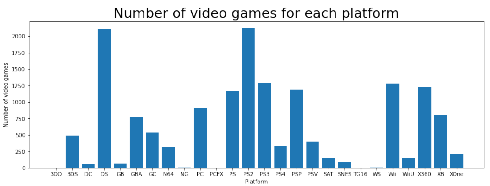
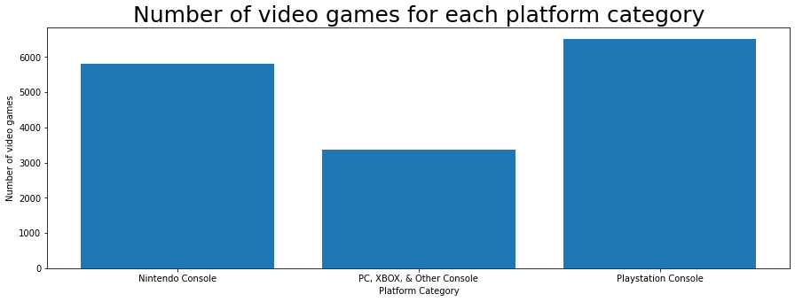

# Predicting Video Game Performance Levels 🎮

Intro

## Doc Overview 📄

This project was the 2nd capstone for my Thinkful coursework. The "Capstone_2.ipynb" file is the Jupyter Notebook containing my code for the project.

The other file, "Predicting Video Game Performance", is the slide deck that was used for the presentation.

## Background ✨

Video games are a large industry in the United States. In 2020, a year where several people were at home due to the pandemic,
the $56.9 billion industry was 27% higher than 2019. With such a large industry, being able to predict which games
will perform well or not-so-well can be useful for a variety of reasons. A video game franchise can use this knowledge to
determine which games to promote so they can maximize sales or the information can be used to help determine what kind of
games to invest in before they're actually released. In this project, I explore some methods for predicting how well
a video game will perform in the global market.

Part I

This section goes over the dataset, exploration, and model preparation portions of the project.

## The Dataset 🗄️

The dataset can be found on [Kaggle](https://www.kaggle.com/gregorut/videogamesales). It contains 16,598 records
of video game data scraped from [VGChartz](https://www.vgchartz.com/). 

The following columns were in the original file:

* Rank
* Name
* Platform
* Year
* Genre
* Publisher
* NA_Sales
* EU_Sales
* JP_Sales
* Other_Sales
* Global_Sales

## Feature Engineering 👨🏽‍🔬

In an effort to help address class imbalances in the platform and publisher variables, the platforms were merged based on
their console type. For example: Game Boy Advance, Nintendo 64, 3DS, and others were merged into a "Nintendo Console" class.
This merging of classes can be seen in the next 2 images.

  
Since this was a classification problem, a target variable had to be created. The Performance Level of a video game
indicates whether it'll perform as well as the top, middle, or bottom third of all video games.
  
The final features and target variable used in our training data were:
* Platform Category (Nintendo, Playstation, PC/XBOX/Other)
* Publisher Volume (At least 10 games, Between 1 and 10 games, and 1 game)
* Genre (Adventure, Arcade, and 10 others)
* Performance Category (Top, Middle, Third)

Part II
 
  
##

